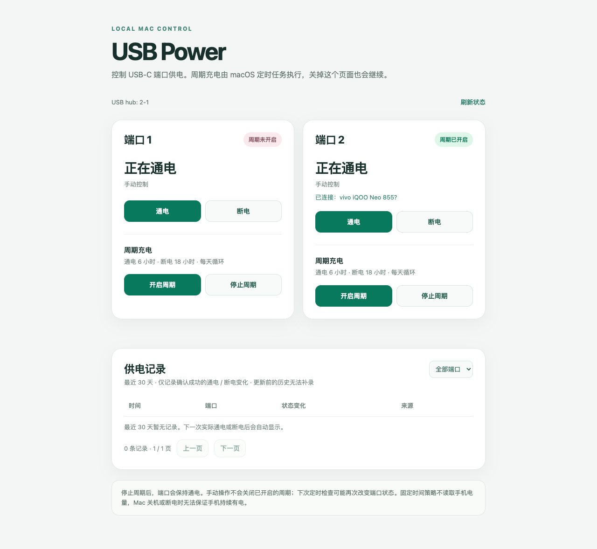

# USB Power for macOS

A small, local control panel for switching USB-C port power with [uhubctl](https://github.com/mvp/uhubctl). It includes a command-line tool and a browser interface.




## Requirements

- macOS with a USB hub that supports per-port power switching (`ppps` in `uhubctl` output)
- `uhubctl` (`brew install uhubctl`)
- Python 3.9 or newer for the web interface

Find the hub and port that correspond to your device with `uhubctl`. Switching a USB-C port may switch its USB2 and USB3 companion ports together. Test the selected port with the device connected before relying on a schedule.

## Supported devices

| Device | Status | Details |
| --- | --- | --- |
| Mac mini (M4, `Mac16,10`) | Tested | Apple USB2 hub `05ac:800b` at `2-1` and USB3 companion hub `05ac:800c` at `2-2`. The front-left USB-C port is port `2` in this setup. Turning it off with `uhubctl` stopped charging the connected phone. |
| Android phone identified by USB ID `05c6:9025` (reported as vivo iQOO Neo 855) | Tested as a load | Charging stopped when port `2` was switched off. The phone model name comes from the USB descriptor and has not been independently verified. |
| Other Macs and USB hubs | Not tested | They may work if `uhubctl` reports per-port power switching (`ppps`), but hub locations and port numbers can differ. Verify the physical port and actual charging behavior before enabling a cycle. |
| USB hubs without `ppps` | Unsupported | This tool cannot cut power on hubs that do not expose per-port power switching to `uhubctl`. |

The tool controls the Mac's USB port, so the phone brand is usually not the compatibility factor. The default hub location is `2-1`; use `usb-power hub LOCATION` if `uhubctl` shows a different location on your Mac. The USB2 and USB3 companion hubs may be switched together by `uhubctl`.

## Install

```bash
git clone https://github.com/gallonyin/usb-power-mac.git
cd usb-power-mac
./install.sh
```

The installer links `usb-power` into `~/.local/bin`. Keep the cloned directory in place because the command and launchd jobs point to it. The installer backs up an existing command before replacing it.

## Use

The control panel displays detected USB device names on their port cards. A connected device without a reported name appears as "未知设备" (unknown device); no device label is shown when nothing is detected. Detection also checks the hub's USB3 companion ports. Charge-only devices and devices on powered-off ports may not be detectable.

```bash
usb-power                # help
usb-power hub            # current hub location; defaults to 2-1
usb-power hub 2-1        # change the saved hub location
usb-power status 2       # read power status
usb-power on 2           # turn on
usb-power off 2          # turn off
usb-power cycle on 2     # start a daily schedule, charging immediately
usb-power cycle status 2
usb-power cycle off 2    # stop schedule, leave the port powered on
usb-power web            # open the local control panel
```

Port defaults to `1`. Double-click `open-usb-power.command` to open the control panel without typing a command. The page binds only to `127.0.0.1:8765`; close the terminal running it to stop the page. The schedule runs separately through a macOS LaunchAgent and continues when the page is closed.

## Fixed schedule

Each port has its own optional schedule: **6 hours on, 18 hours off**, repeated every 24 hours from the time the schedule is enabled. A LaunchAgent checks every 5 minutes. After login or wake, it applies the phase calculated from the original start time. Stopping the schedule turns the port on.

This is a timer, not battery-aware charging. It cannot guarantee that a phone stays powered: workload, charging speed, battery age, Mac sleep, shutdown, power loss, and failed USB switching can all change the outcome. Observe the phone's charge after an 18-hour off period before leaving it unattended. Where available, a built-in battery charge limit is more precise for battery care.

## Privacy and security

The control panel shows confirmed power transitions from the last 30 days, with time, port, before/after state, and source (CLI, web, or scheduled cycle). Records are saved locally in `~/Library/Application Support/usb-power/power-history.tsv` and retained without automatic deletion. History begins after installing this version; earlier activity cannot be reconstructed. Repeated checks that find the port already on/off do not create duplicate entries. Changes made directly with `uhubctl`, outside this tool, are not recorded.

The web interface has no cloud service, binds to loopback only, and requires a session token for changes. It uses Python's standard library and invokes the local CLI. Do not expose port 8765 through a proxy or tunnel.

## Development

```bash
bash -n usb-power install.sh open-usb-power.command
python3 -m unittest discover -s tests
```

## License

MIT. See [LICENSE](LICENSE).
